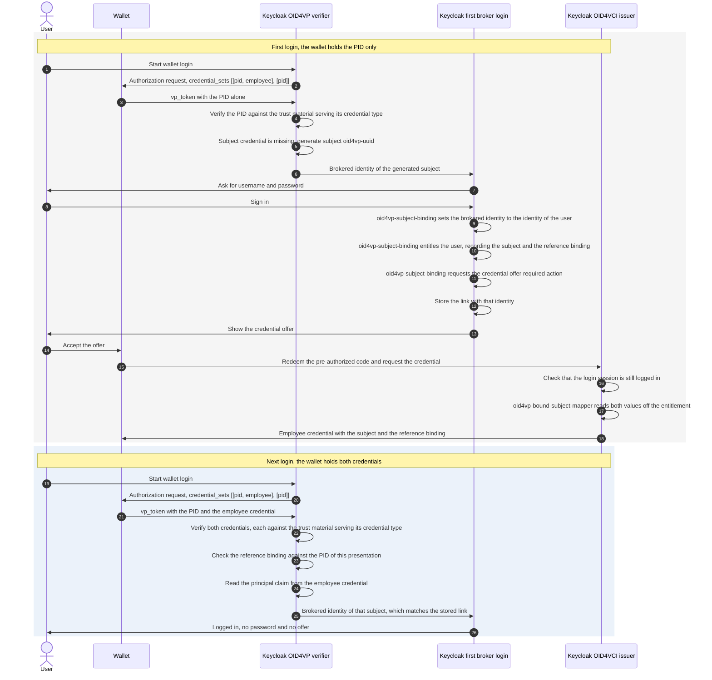

# Configuration

The extension is configured as a Keycloak identity provider. All settings are stored in the IdP provider config. They can be managed through the Admin UI or realm import JSON.

## Adding the Identity Provider

1. Open the Keycloak Admin Console.
2. Go to **Identity Providers**.
3. Select **OID4VP**.
4. Configure the provider settings.

Transient wallet logins require Keycloak to be started with the `transient-users` feature enabled. Then enable the IdP's built-in **Do not store users** option in Keycloak.

Example realm import fragment:

```json
{
  "identityProviders": [
    {
      "alias": "oid4vp",
      "displayName": "Sign in with Wallet",
      "providerId": "oid4vp",
      "enabled": true,
      "config": {
        "clientIdScheme": "x509_san_dns",
        "responseMode": "direct_post.jwt",
        "x509CertificatePem": "-----BEGIN CERTIFICATE-----\n...\n-----END CERTIFICATE-----",
        "walletScheme": "openid4vp://"
      }
    }
  ]
}
```

## Settings

### Credential Request

The DCQL query is generated from the configured OID4VP mappers. The mapper type determines the credential format. The mapper configuration contributes the credential type and claim path. The [IdP mappers](#idp-mappers) section describes how claim sets are formed. At least one mapper with a credential type is required.

| Key | Description | Default |
|-----|-------------|---------|
| `credentialSets` | DCQL `credential_sets` constraints in specification syntax, referencing credential ids. Empty requires every configured credential. | *(none)* |
| `requestObjectLifespanSeconds` | Lifespan of the signed request object JWT used by the wallet fetch. | `10` |

Each mapper contributes to the credential named by its `credential.id`. Mappers sharing an id form one credential entry. That entry accepts every credential type any of them names. This allows requesting the same credential type twice with different claims. It also allows one entry to accept several VCTs. A credential of a type derived from a requested type satisfies the request as well, see [Credential Type Inheritance](#credential-type-inheritance). An empty `credential.id` derives the id from the format and the first credential type: `sdjwt_urn_eudi_pid_1`, `mdoc_org_iso_18013_5_1_mDL`. DCQL restricts ids to letters, digits, `_` and `-`.

`credentialSets` lists alternative credential combinations in preference order. To request a PID together with an mDL but accept the PID alone:

```json
[{"purpose": "Login", "options": [["sdjwt_urn_eudi_pid_1", "mdoc_org_iso_18013_5_1_mDL"], ["sdjwt_urn_eudi_pid_1"]]}]
```

`required` defaults to `true`. An entry with `"required": false` describes an optional extra credential. Without `credentialSets` the query carries no `credential_sets` member. DCQL then requires every credential in the query.

The configuration is validated when the identity provider is saved. It is validated again when the DCQL query is built, because identity provider mappers have no validation hook of their own. A presented credential set that satisfies no option of a required set rejects the login.

### User Mapping

| Key | Description | Default |
|-----|-------------|---------|
| `principalAttributes` | The claims that identify the user, as a comma separated list of `credentialId:claimPath` entries in the order they are tried. See [Which Claim Carries the Subject](#which-claim-carries-the-subject). Required unless OID4VP transient users are enabled. | *(none)* |
| `allowMissingSubjectCredential` | Accepts a presentation that does not carry the subject credential. Requires `principalAttributes`, because the setting says which credentials may be missing. See [Subject Credential Issued by This Keycloak](#subject-credential-issued-by-this-keycloak). | `false` |
| `doNotStoreUsers` | Native Keycloak IdP setting. When enabled, OID4VP switches to transient per-login identities, ignores configured identifying claims, and relies on Keycloak transient users. Requires the Keycloak `transient-users` feature to be enabled. | `false` |
| `clockSkewSeconds` | Allowed clock skew for ID token time checks. | `60` |

### Which Claim Carries the Subject

`principalAttributes` says which claim of which credential identifies the user. It is required because nothing else identifies the user. Which claim carries the subject depends on the credential, not on the identity provider. A single verifier-wide claim name cannot serve a query of several credentials.

```properties
principalAttributes = sdjwt_urn_eudi_pid_1:sub, mdoc_eu_europa_ec_eudi_pid_1:eu\.europa\.ec\.eudi\.pid\.1.family_name
```

Each entry is a DCQL credential id, a colon, and the claim of that credential.

The claim path starts at the root of what the credential presented.

- An SD-JWT credential presents its claims directly. The path is the claim: `employee:sub`, or `employee:credential_subject.id` for a nested one.
- An mDoc presents its data elements inside namespaces. The path names the namespace before the element. The dots inside a namespace are escaped with a backslash. The doctype namespace `eu.europa.ec.eudi.pid.1` is written `eu\.europa\.ec\.eudi\.pid\.1`. The namespace is never inferred from the presentation. A credential carrying a second namespace cannot answer for the subject.

The entries are tried in order. The first one a wallet actually presented supplies the subject. A wallet holding the PID in one of two formats reaches the same account either way. Which credential answers is the verifier's decision, not the wallet's.

The rules that are checked when the identity provider is saved:

- Every required credential set option has to contain one of the named credentials. Otherwise a combination a wallet may present could identify nobody. `allowMissingSubjectCredential` lifts this rule.
- Every named credential has to request its claim in every claim set option. A wallet answering another option then still presents a subject. The generated DCQL query adds that claim to the credential's entry.
- A credential may be named once. Naming it twice leaves it unclear which claim carries the subject.

### Subject Credential Issued by This Keycloak

A verifier can ask for a PID together with a credential that this Keycloak issued itself. The PID carries the attributes. The issued credential carries the identifier of the user. This split is needed when the PID has no identifier of its own. That is the case for the German PID.

Configure the identity provider like this:

```properties
credentialSets                = [{"options": [["pid", "employee"], ["pid"]]}]
principalAttributes           = employee:sub
allowMissingSubjectCredential = true
```

Configure the authenticator `oid4vp-subject-binding` like this:

```properties
credentialConfigurationId = employee-credential
offerClientId             = wallet-vci
```

The wallet may present both credentials or the PID alone. The second option of the credential set allows the PID alone.

**The user presents both credentials.** The principal claim of the employee credential holds the subject of the account. It identifies the user. The login proceeds like any other wallet login.

Which claim that is comes from the `employee` entry of `principalAttributes`. In this example it is `sub`. Any other claim works as long as the issuer writes the subject into it. The claim named there and `claim.name` on the issuing mapper have to be the same.

**The user presents the PID alone.** Nothing in the presentation says who the user is. The verifier generates a subject of the form `oid4vp-<uuid>` and continues the login with it. Keycloak runs the first broker login flow. There the user signs in with username and password. The authenticator `oid4vp-subject-binding` then sets the brokered identity to the identity of that user, before Keycloak stores the link. The same authenticator entitles the user to the employee credential. It ends the login in the Keycloak credential offer required action, which offers the credential.

The issued credential carries a subject of its own in that claim. The mapper `oid4vp-bound-subject-mapper` of this extension writes it. The subject is derived from the Keycloak user id with a realm secret. The wallet and every verifier the credential is shown to read an opaque value rather than an internal identifier. The next presentation of that credential derives the same identity and reaches the same account.

The authenticator records that subject on the entitlement it grants. The mapper reads it back when the credential is issued. Keycloak redeems the pre-authorized code in a session of its own. The entitlement is the only thing of the login the issuance sees.

The offer is bound to the login that created it. Keycloak accepts the pre-authorized code only while the session of that login is still logged in, the user is unchanged, and the password of the user is unchanged. An offer cannot be redeemed after the user logs out.

The user signs in with a password only until the credential is issued. A user who loses the credential signs in with a password again and receives a new one.



Both logins reach the same account because both derive the same brokered identity. The identity is `Base64Url(SHA-256(subject))` over the trimmed and lowercased subject. Neither the issuer nor the credential format is part of it. Keycloak scopes it to the identity provider alias on its own. Every credential named in `principalAttributes` therefore has to come from an issuer that assigns the subject. A credential whose holder chooses the subject claim at issuance can name the subject of another credential and reach that account. The credential this Keycloak issues carries a subject derived from the user id and the reference credential binding described below, so it identifies one account and one person.

That identity is stored in the Keycloak federated identity link of this identity provider. The first broker login flow writes the link when it finishes. Nothing is written to a user attribute. The user id is never stored, not even inside the link.

`allowMissingSubjectCredential` accepts the presentation without the subject credential. It lifts the rule that every required credential set option has to contain one of the named credentials.

The realm needs a first broker login flow that authenticates the user instead of creating one. Use a flow with `idp-username-password-form` followed by `oid4vp-subject-binding`, both required. The default flow creates a user when nothing matches an existing account. A German PID matches nothing.

A user who lost the credential runs that flow a second time. Keycloak refuses to link a user it has linked before. The authenticator replaces the existing link of this identity provider for that reason. The subject is derived from the user. The link written a moment later holds the same identity.

The credential offer is configured on `oid4vp-subject-binding`, because that is where the login is bound to the user. `credentialConfigurationId` names the credential configuration of the issuer. That configuration is what the offer offers. An empty value means no offer. `offerClientId` names the client the offer is addressed to. The wallet asks for the credential as that client.

The issuer side of the realm needs the following.

1. The Keycloak features `oid4vc-vci` and `oid4vc-vci-preauth-code`, because the offer is pre-authorized.
2. Verifiable credentials enabled on the realm. Keycloak refuses the `oid4vc` protocol for a realm that does not have them enabled.
3. A realm signing key whose certificate a certificate authority issued. Keycloak refuses to issue an SD-JWT credential with a self-signed signing certificate.
4. A credential scope for the employee credential, of protocol `oid4vc`, with the credential configuration id, the credential type, the format `dc+sd-jwt` and a signing algorithm. Set `vc.binding_required` to `true` and `vc.binding_required_proof_types` to `jwt`. The wallet then proves possession of its key and receives a credential it can present with a key binding JWT.
5. The mapper `oid4vp-bound-subject-mapper` on that scope, with `claim.name` set to the claim `principalAttributes` names for this credential (`sub` in this example). It writes the subject the login was bound to and the reference credential binding of that login.
6. `vc.credential_build_config.sd_jwt.visible_claims` set to `id,iat,nbf,exp,jti,oid4vp_reference_binding`. The verifier reads the reference credential binding of every credential it is offered as a subject. The binding may not sit behind selective disclosure. Suppose it does, and the subject credential is presented alongside credentials the binding would cover. The verifier then does not accept that credential as the subject. The login falls back to a fresh subject and issues a bound credential again, as on a first login. It does not trust a subject credential whose binding was withheld. The claims Keycloak keeps visible by default have to stay in that list, because the setting replaces them.
7. A client with OID4VCI enabled that has the credential scope, named by `offerClientId`. The wallet has to ask for the credential as this client.

Keycloak only offers a credential to a user who is entitled to it. The authenticator grants that entitlement during the login. It records the subject and the reference credential binding on it. An entitlement granted by an administrator instead would yield a credential that identifies nobody.

The offer is made on every login the authenticator binds, even when the user holds the entitlement. Arriving there means the presentation carried no subject credential.

#### Reference Credential Binding

The credential this Keycloak issues identifies an account on its own. Without more, an employee credential of one person and a PID of another would sign in as the first person. The PID is verified but compared to nothing.

The issued credential carries a reference credential binding for that reason. The binding is a keyed digest of the credential types and claims it was issued alongside. The verifier recomputes that digest from the credentials of the presentation in front of it. When the two differ, it treats the credential as not presented. Neither its subject nor its claims reach the login. This is not the holder binding of OID4VC, which ties a credential to a wallet key. It ties a credential to the other credentials of a presentation.

What it recognises is the person those credentials name, not the credential instances themselves. Binding to an instance is impossible. A PID is re-issued regularly and issued in batches. Every copy carries a different key and different dates. Two people who share every bound claim share a binding. That is why the credential type is part of the digest. It is also why the selection should name the claims that identify a person.

The digest is an HMAC over a realm secret. The value rides in a credential the wallet shows to other verifiers. A plain hash of names and dates is recovered from a candidate list within seconds. Passive realm keys are accepted when the binding is checked. A key rotation does not invalidate credentials that were issued before it.

Which claims of which credentials the digest covers is a deployment decision. It is made through the `oid4vp-reference-credential-binding` provider. The `pid` provider ships with the extension. It binds the issued credential to the mandatory attributes of the SD-JWT PID. It takes its selection from the server configuration. The login that issues a credential and the login that presents it again share no other configuration.

```properties
--spi-oid4vp-reference-credential-binding-pid-credential-types=urn:eudi:pid:1
--spi-oid4vp-reference-credential-binding-pid-claims=given_name,family_name,birthdate,personal_administrative_number
```

Those are the defaults. A deployment presenting an SD-JWT PID needs no configuration. Credentials are selected by type. The type is the VCT of an SD-JWT credential and the doctype of an mDoc. A deployment binding to the mDoc PID configures its doctype `eu.europa.ec.eudi.pid.1` together with the mDoc element names, for example `birth_date` rather than `birthdate`. The default selection includes `personal_administrative_number`. It distinguishes two people who share a name and a date of birth. It is only bound when the PID actually carries it. A deployment whose PIDs omit it should name another claim that is unique to the person.

Claims are read exactly as the [IdP mappers](#idp-mappers) read them, by a path in dot notation. A nested claim of an SD-JWT credential is addressed as `place_of_birth.locality`. An array is addressed as `nationalities[]`. An mDoc path resolves inside the namespace of the credential. One selection covers both formats. A path means the same thing here as in a mapper.

An object or array claim is read with its keys ordered. A wallet that renders the same claim differently on the next login still produces the same binding. Mappers write their values the same way.

At least one claim path is required. An empty `claims` is refused at startup. Binding to everything a credential carries would cover its issuance metadata as well. A re-issued PID, or another copy of a batch issued one, would then break the binding on the very next login.

Every bound claim is one whose change costs the user a password login. The verifier treats the credential as not presented. The user signs in with a password and receives a credential bound to the PID of today. Selecting fewer claims makes that rarer and the binding weaker. A deployment binding to something other than a PID writes its own provider for this SPI.

A credential carrying no reference binding is accepted in any presentation. A credential of another issuer is such a credential.

### Transient Login Mode

To use this extension as a wallet connector without creating persisted Keycloak users:

1. Start Keycloak with the `transient-users` feature enabled.
2. Enable the IdP's built-in **Do not store users** setting.
3. Keep using the normal first broker login flow. Keycloak creates a `LightweightUserAdapter` and a transient user session instead of a stored user.

Behavior in this mode:

- The extension always generates a random per-login transient identifier.
- `principalAttributes` is ignored for subject resolution.
- OID4VP user-attribute mappers still apply. The target user is transient and is not persisted after the session ends.
- Session-note mappers are often the best fit when relying parties only need token-time claim propagation.

This mode is intended for credentials that do not carry a stable account identifier, such as German PID variants.

### Flow Control

| Key | Description | Default |
|-----|-------------|---------|
| `sameDeviceEnabled` | Enables same-device wallet login. | `true` |
| `crossDeviceEnabled` | Enables cross-device QR-code wallet login. | `true` |
| `sameDeviceMaxLoa` | Highest requested level of authentication the same-device flow is offered at. The level is the integer Keycloak derives from the client's `acr_values` or `claims` request through the realm or client ACR-to-LoA mapping. Empty means no ceiling. | *(none)* |
| `crossDeviceMaxLoa` | Highest requested level of authentication the cross-device flow is offered at, with the same semantics as `sameDeviceMaxLoa`. | *(none)* |
| `walletScheme` | URI scheme used to invoke the wallet app, for the same-device and cross-device flows alike. | `openid4vp://` |
| `responseMode` | Wallet callback response mode. `direct_post.jwt` encrypts the wallet response and is what wallets following the high assurance profile expect. | `direct_post.jwt` |
| `rejectionResponse` | How the response URI answers a presentation the verifier rejects. `redirect` answers with HTTP 200 and the `redirect_uri` that returns the End-User to the login page. `error` answers with HTTP 400 and the error beside that `redirect_uri`. A wallet aborting on a non-2xx status never follows that `redirect_uri`. Wallet-reported errors are answered with HTTP 200 either way. | `redirect` |
| `requestUriMethodPost` | Advertises `request_uri_method=post`. A conforming wallet then retrieves the request object with POST (OID4VP 1.0 §5.10) and sends its `wallet_metadata` and `wallet_nonce`. This enables request-object encryption and `wallet_nonce` replay protection. Leave off for wallets that retrieve the request object with GET only. | `false` |

A flow above its ceiling is not offered on the login page. Its state is never created. No request object exists for it, and nothing a wallet posts can complete it. When the requested level exceeds the ceiling of every enabled flow, the login ends on an error page. A request that names no level reaches every enabled flow. A ceiling value that is not an integer is rejected when the provider is saved.

The ceilings apply when the wallet login runs. Whether an existing SSO session must re-authenticate for a requested level is decided by the realm's step-up flow configuration. The level itself comes from the request as Keycloak maps it. An `acr` value the ACR-to-LoA mapping does not name counts as the minimum level. A request naming several `acr` values counts as the lowest of them.

### Client Authentication (X.509)

| Key | Description | Default |
|-----|-------------|---------|
| `clientIdScheme` | Wallet/verifier client ID scheme: `plain`, `x509_san_dns`, or `x509_hash`. `x509_hash` identifies the verifier by the hash of its certificate and is what wallets following the high assurance profile expect. | `x509_hash` |
| `x509CertificatePem` | PEM-encoded verifier certificate material used for client ID derivation and request-object header material. | *(required for x509 schemes)* |
| `x509SigningKeyJwk` | Explicit signing JWK override. Normally derived automatically. | *(auto-derived)* |
| `verifierInfo` | JSON value for the request object's `verifier_info` claim. | *(none)* |

`x509CertificatePem` supports two practical layouts:

1. Combined PEM with leaf certificate, optional intermediate certificates, and private key.
2. Certificate-only PEM when request objects should be signed with the Keycloak realm signing key instead.

Multi-line values stay usable in single-line sources such as environment variables from Kubernetes secrets. `x509CertificatePem`, `x509SigningKeyJwk`, `verifierInfo`, `trustListSigningCertPem`, and `trustedCertificates` accept their value verbatim or Base64-encoded as a whole. The PEM values additionally accept `\n` escape sequences instead of line breaks.

### Trust and Verification

| Key | Description | Default |
|-----|-------------|---------|
| `trustMaterialIdps` | Comma-separated aliases of trust material identity providers (see below). Each referenced provider contributes trust anchors, directly trusted issuer certificates, issuer keys, and revocation trust for the credential types it serves. | *(none)* |
| `allowedIssuers` | Comma-separated list of allowed SD-JWT issuer (`iss`) values, or `*`. mDoc credentials are not checked against this list. mDoc does not define a standard canonical credential-issuer string equivalent to SD-JWT `iss`. | `*` |
| `clockSkewSeconds` | Clock skew tolerance for credential verification. | `60` |
| `kbJwtMaxAgeSeconds` | Maximum accepted age of the SD-JWT KB-JWT `iat` claim. | `300` |

Trust configuration lives on separate trust material identity providers, referenced by alias. This matches the trust material delegation model of upstream Keycloak's OID4VP work.

### Trust per Credential

A response can carry credentials of several trust domains, for example a PID from a national trust list next to a credential this Keycloak issued itself. Trust is resolved per credential, not once per identity provider.

Every trust material identity provider declares the credential types it serves in `servedCredentialTypes`. A credential is verified against the material of the providers serving its credential type. Its DCQL entry advertises the `trusted_authorities` those providers expose. A provider that declares no credential types serves all of them.

`servedCredentialTypes` is read from the configuration of the referenced provider, not from the provider type. A trust material provider that knows nothing of this extension is scoped the same way. Add that key to its configuration.

Selection starts from the credential id the wallet answered with and the types requested under it. Both are taken from the request context. A credential id that was not requested is rejected before any signature is verified. The type the presentation names has to be one of the requested types or derive from one (see [Credential Type Inheritance](#credential-type-inheritance)). Otherwise the presentation is rejected before verification. That type selects the trust material. The verified type is checked against the same entry afterwards. A wallet cannot have its credential judged by the trust domain of a type it does not carry. An entry requested with several types advertises the `trusted_authorities` of all of them.

### Credential Type Inheritance

A credential of a derived type satisfies a request for the type it derives from. The German PID `urn:eudi:pid:de:1` answers a request for the EUDI PID `urn:eudi:pid:1`. The reverse does not hold. Two sources state the relationship:

- The `aka_vcts` claim of an SD-JWT VC lists further types the credential is of (SD-JWT VC, section 2.2.2.2).
- A URN type whose qualifier segments sit between its name and its numeric version derives from the type without them. `urn:eudi:pid:de:1` derives from `urn:eudi:pid:1`, and `urn:eudi:pid:de:bavaria:1` derives from both. This is how the ARF forms domestic PID types. Type metadata is not consulted. The PID types are URNs with no document to retrieve.

Inheritance says what a credential is, not who may issue it. Trust material is selected by the nearest type a provider declares in `servedCredentialTypes`. The credential's own type is tried first, then its base types. The types `aka_vcts` names are tried after that, each with its base types, and only when no provider declares the credential's own type or one of its base types. A provider declared for `urn:eudi:pid:de:1` judges the German PID. Without one, the provider declared for `urn:eudi:pid:1` does. A base type's provider serves every derived type that has no provider of its own. The reverse never happens. The same rule decides which `trusted_authorities` a requested type advertises.

An issuer is trusted for what its credentials say about themselves. A credential of one type that names a second type in `aka_vcts` satisfies a request for the second type, verified by the trust material of the first. Reference only issuers whose credentials may stand for every type they name.

### Trust Cases

| Case | Credential carries | Key resolution | Advertised `trusted_authorities` | Configuration |
|------|--------------------|----------------|----------------------------------|---------------|
| ETSI trust list | `x5c` chain | PKIX path to the anchors of the Issuance services on the list | `etsi_tl` with the list URL or `aki` with the key identifiers, when configured | `etsi-trust-list` with `trustListUrl` |
| Pinned certificate bundle | `x5c` chain, or nothing | PKIX path to the CA certificates. End entity certificates are trusted directly | `aki` with the key identifiers, when configured | `etsi-trust-list` with `trustedCertificates` |
| Keycloak-issued, CA-chained realm key | `x5c` chain to the CA that issued the realm key certificate | the realm key certificate as a directly trusted leaf | none | `keycloak-realm-issuer` |
| Keycloak-issued, chainless | JOSE `kid` only | the realm's published signature keys and the realm key certificates, both trusted for the realm issuer alone | none | `keycloak-realm-issuer` |
| mDoc | `x5chain` in COSE | PKIX path or a pinned leaf certificate. A chain whose leaf is itself a configured trust anchor is trusted directly. This accepts a self-signed document signer certificate placed on a trust list | `etsi_tl` or `aki` | an X.509 provider. There is no COSE `kid` route for a key-only provider to serve a doctype |
| Issuer JWKS | JOSE `kid` only | the keys the provider publishes, trusted for any issuer | none | Keycloak's `default-trust` with `jwksUrl` or a pasted JWK |
| Revocation | status list JWT | the status list certificates of the providers serving that credential | not applicable | follows the credential's trust domain |

A credential type that no provider serves has no trust material. Its presentation cannot be verified. This is logged when the query is built. It is only reported once providers declare credential types at all.

### Keycloak Default Trust Identity Provider (`default-trust`)

An issuer that publishes plain JWKs instead of a trust list is trusted through Keycloak's own `default-trust` provider. Configure it with `jwksUrl` or a pasted JWK. Reference it in `trustMaterialIdps` like the providers of this extension. Two limits follow from the upstream contract, which returns keys without saying whose they are. Its keys are trusted for any issuer. `allowedIssuers` is what restricts them. It advertises no `trusted_authorities`, because a bare key has nothing a wallet could match. Set `servedCredentialTypes` in its configuration. Otherwise its keys verify every credential of every request that references it.

### ETSI Trust List Identity Provider (`etsi-trust-list`)

A dedicated identity provider type carries the trust material. It never authenticates users and is hidden from login pages. OID4VP identity providers reference it through `trustMaterialIdps`. Trust anchors come from an ETSI TS 119 602 trust list URL, from a pasted PEM certificate bundle, or both. The trust list is fetched, cached, and refreshed automatically. CA certificates become X.509 trust anchors for credential certificate chains. End entity certificates are trusted directly (pinned leaf or chainless credentials).

A directly trusted end entity certificate verifies the credentials of the types its provider serves, regardless of the credential's `iss`. A certificate chain validated against the CA anchors additionally requires the `iss` to match a subject alternative name of the leaf certificate.

| Key | Description | Default |
|-----|-------------|---------|
| `trustListUrl` | URL of an ETSI TS 119 602 trust list JWT. | *(none)* |
| `trustListSigningCertPem` | PEM-encoded certificate chain used to verify the trust list JWT signature. If omitted, the trust list JWT is not signature-verified. | *(none)* |
| `trustListLoTEType` | Expected trust-list LoTE type. Keep one trust domain per provider instance. Leave empty only to accept all LoTE types from the configured trust list. | empty |
| `trustListMaxCacheTtlSeconds` | Optional maximum cache TTL for the trust list. The effective lifetime is capped earlier by ETSI `NextUpdate` and HTTP cache headers. | *(use trust-list freshness metadata)* |
| `trustListMaxStaleAgeSeconds` | Maximum age of an expired trust-list cache entry that may be reused when refresh fails. Set `0` to disable stale fallback. | `86400` |
| `trustedCertificates` | PEM-encoded X.509 certificate bundle of trusted issuers, used instead of or in addition to the trust list URL. | *(none)* |
| `servedCredentialTypes` | Comma-separated credential types (SD-JWT VCT or mDoc doctype) this trust domain is responsible for. Empty serves every credential type. | *(none)* |
| `advertiseTrustedAuthorities` | The `trusted_authorities` entry the DCQL entries of the served credentials advertise. `etsi_tl` advertises the trust list URL, `aki` the key identifiers of the trusted certificates. Empty advertises nothing. At most one entry per trust domain, because both types describe the same anchors. The verifier enforces the trust either way. | *(empty, advertise nothing)* |
| `requiredExtendedKeyUsages` | Comma-separated extended key usage OIDs. When set, credential signing certificates must contain at least one of them (e.g. `1.0.18013.5.1.2` for mDL document signers). | *(none)* |

### Keycloak Realm Issuer Identity Provider (`keycloak-realm-issuer`)

Trust material for credentials this Keycloak issues itself. The material is the signature key material of the issuing realm, read in process. The published JWKs serve credentials that identify their key by `kid`. The realm key certificates serve as directly trusted issuer certificates for credentials that pin their leaf in `x5c`. Both are bound to the realm's issuer identifier. A credential claiming to come from somewhere else cannot borrow them. Nothing has to be pasted. A key rotation takes effect without reconfiguration, because passive keys stay published while credentials signed with them are still valid.

| Key | Description | Default |
|-----|-------------|---------|
| `servedCredentialTypes` | Comma-separated credential types this Keycloak issues. Required. The realm keys are trusted for these credentials only. | *(none, rejected)* |
| `issuerRealm` | Name of the realm whose signature keys sign the credentials. | *(the realm the OID4VP identity provider runs in)* |
| `issuer` | The credential `iss` the realm keys are trusted for. | *(derived from the issuer realm, the value its JWT VC issuer metadata publishes)* |

A realm key certificate issued by an external CA works the same way. The signing leaf is trusted directly. A credential presenting the full chain validates against the pinned leaf. The CA does not have to be configured anywhere in Keycloak.

For SD-JWT VC verification, the verifier tries issuer-key resolution in this order:

1. `x5c` certificate-chain validation. Either a pinned trusted leaf certificate bound to the credential's `iss`, or a PKIX path to the trust anchors with the `iss` matching a subject alternative name of the leaf certificate
2. The issuer keys the credential's trust domain publishes, matched on the credential's `iss` and JOSE `kid`
3. JWT VC issuer metadata lookup via `iss` + `kid` from `/.well-known/jwt-vc-issuer`, including `jwks_uri`. This route is used only when the identity provider references no trust material providers at all. With trust material providers configured, a credential type none of them serves is rejected. A credential whose declared trust domain resolves to nothing is rejected as well.

A certificate chain is mandatory when the credential's trust domain consists of CA anchors alone. Pinned issuer certificates and published issuer keys make a chainless credential a configured case rather than a missing chain.

By default, the verifier only trusts the credential types this IdP requested in its DCQL query. Those types come from the credential types declared on the configured OID4VP mappers.

Use one trust material identity provider instance per trust domain. If `trustListLoTEType` is configured, it must match the fetched trust list's `ListAndSchemeInformation.LoTEType`. If it is left empty, all LoTE types from that trust list are accepted.
Within the accepted trust list, credential signature verification uses only `.../SvcType/.../Issuance` services. Status-list JWT verification uses only `.../SvcType/.../Revocation` services.

### Caching

Trust lists are cached until the earliest of ETSI `ListAndSchemeInformation.NextUpdate`, HTTP cache headers, and the trust material identity provider's `trustListMaxCacheTtlSeconds` when configured. A trust list whose `NextUpdate` is in the past is discarded as expired. `NextUpdate` is read as an ISO 8601 instant. That is the form ETSI TS 119 602 clause 6.1.3 prescribes: `YYYY-MM-DDThh:mm:ssZ` in UTC, seconds field present, no decimal fraction. A trust list whose `NextUpdate` cannot be read as an instant is rejected as a whole. A value that leaves the seconds out is one example. Trust-list responses without `NextUpdate` are not cached and are not reused as stale fallback. Status lists are cached according to their `ttl` claim when present, capped by `exp` if present. If `ttl` is absent they fall back to `exp`. Status-list responses without both `ttl` and `exp` are treated as immediately expired. JWT VC issuer metadata caching is bounded by HTTP cache headers, `issuerMetadataMaxCacheTtlSeconds`, and each JWK's optional `exp`, whichever expires first.

| Key | Description | Default |
|-----|-------------|---------|
| `statusListMaxCacheTtlSeconds` | Optional maximum cache TTL for token status lists. The effective lifetime uses status-list `ttl` when present, capped by `exp`. Otherwise it falls back to `exp`. | *(use status-list ttl / exp)* |
| `issuerMetadataMaxCacheTtlSeconds` | Optional maximum cache TTL for JWT VC issuer metadata and resolved issuer JWKS. The effective lifetime is capped earlier by HTTP `Cache-Control` and any JWK `exp`. Set `0` to disable issuer-metadata caching. | `86400` |

### Cross-Device SSE

| Key | Description | Default |
|-----|-------------|---------|
| `ssePollIntervalMs` | How often each SSE connection polls shared completion state. | `2000` |
| `sseTimeoutSeconds` | Maximum SSE connection lifetime before timeout. | `120` |
| `ssePingIntervalSeconds` | Keep-alive ping interval. | `10` |
| `crossDeviceCompleteTtlSeconds` | Lifetime of the cross-device completion marker. The deferred auth record itself uses the realm login timeout. | `300` |

Every open SSE connection polls from a virtual thread of its own for up to `sseTimeoutSeconds`. The extension sets no limit on how many connections a node holds. The HTTP connection limit of the server bounds them. Set `quarkus.http.limits.max-connections` in `conf/quarkus.properties` to cap concurrent connections on a node. The limit counts every HTTP connection, not only SSE streams.

## IdP Mappers

The extension provides format-specific mapper types. They follow the mapper design of upstream Keycloak's OID4VP work:

- `SD-JWT Attribute Importer` (`oid4vp-sd-jwt-user-attribute-idp-mapper`)
- `SD-JWT User Session Attribute Importer` (`oid4vp-sd-jwt-user-session-attribute-idp-mapper`)
- `mDoc Attribute Importer` (`oid4vp-mdoc-user-attribute-idp-mapper`)
- `mDoc User Session Attribute Importer` (`oid4vp-mdoc-user-session-attribute-idp-mapper`)
- `eIDAS LoA User Session Attribute` (`oid4vp-eidas-loa-user-session-attribute-idp-mapper`)

Each mapper declares a credential type (VCT or doctype) and a claim path. An SD-JWT mapper may declare several VCTs as a comma-separated list, for example `urn:eudi:pid:1, urn:eudi:pid:de:1` for the EUDI PID and the German PID. They form one credential entry whose `vct_values` lists all of them. The wallet presents a credential of any of these types. Mappers sharing a credential id accept every VCT any of them names. The default credential id is derived from the first type. An mDoc mapper declares exactly one doctype, because DCQL defines `doctype_value` as a single string. Request several doctypes under credential ids of their own. The claim path uses dot notation. `address.locality` selects a nested claim. `nationalities[]` selects all array elements. `nationalities[0]` selects the first presented element. A literal dot is escaped as `\.`. Arrays import as multivalued attributes. Object values import as their JSON representation. Session attribute mappers join multiple values with commas.

mDoc mappers additionally declare the ISO 18013-5 `namespace` of the data element. It defaults to the credential type (doctype). The claim path addresses the element within that namespace. Deeper path steps select into structured element values on the mapper side only. Element values holding serialized JSON objects or arrays become nested structures in the claims JSON. They follow the same path rules as SD-JWT claims.

The `Alternative Claims` mapper option names claims that stand in for the claim path when the credential does not present it. It is a comma-separated list of paths in the same notation. Issuers name the same claim differently. The German PID rulebook calls the birth name `birth_name`. Credentials in circulation carry `birth_family_name`. A single mapper with the claim `birth_family_name` and the alternative `birth_name` covers both. The mapper reads the claim path first and the alternatives after it in their order. The first one the presentation carries a value for is imported. Every alternative is requested as a claim of its own. The [claim sets](#claim-sets) are generated so that the wallet presents exactly one of them.

### Presentation Flow

Every completed login stores the flow it finished in as the user session note `oid4vp_presentation_flow`. The value is `same_device` or `cross_device`. Custom identity provider mappers read the same value from the brokered identity context through `Oid4vpMapperUtils.presentationFlow`.

The flow records which login page affordance started the presentation: the same-device link or the cross-device QR code. OID4VP does not bind the wallet to the device the browser runs on. The note describes the login that created the session. A token issued from SSO reuse carries the value of that login.

The `eIDAS LoA User Session Attribute` mapper writes a level of assurance chosen by that flow into a configurable user session attribute. The attribute defaults to `eidas_loa`. The values are `STORK-QAA-Level-4` for a same-device and `STORK-QAA-Level-3` for a cross-device completion. Set the mapper's sync mode override to `Force`. The attribute is then also set when a first wallet login links an existing account. Use the `User Session Note` protocol mapper on the client or client scope to surface these values in tokens.

These mappers drive the generated DCQL request. Every distinct `credential.id` present in the mappers becomes a DCQL credential entry. Every claim path becomes a requested claim. The response is validated against this query. All requested claims are known to the verifier.

### Claim Sets

The `Claim Set IDs` mapper option controls the DCQL `claim_sets` for a credential. It holds a comma-separated list of identifiers:

- A mapper without claim set ids marks its claim as always requested. It is part of every claim set.
- When at least one mapper of a credential defines claim set ids, the generated credential entry contains one `claim_sets` option per distinct id.
- Options are ordered lexicographically by id. The order expresses the verifier's preference. Wallets use the first option they can satisfy. Use a naming convention such as `1-full`, `2-minimal` to control the order.
- A claim that belongs to several sets lists all of their ids.

Example: three mappers for `given_name` (ids `1-full`), `family_name` (ids `1-full,2-min`), and `birthdate` (no ids) produce two claim set options. `given_name, family_name, birthdate` is preferred. `family_name, birthdate` is the fallback.

Alternative claims multiply these options. Every option is repeated once per combination of the path choices of its members. Each option then asks for exactly one of a claim and its alternatives. The combinations keep the claim paths themselves first and vary the alternatives of the last member fastest. The first option asks for every claim under its own path. The last one asks for every claim under its last alternative. A mapper with alternatives and no claim set ids still produces claim sets, one option per path. The number of options is the product of the path counts of all members of an option, on top of the options the claim set ids define. Three mappers with one alternative each and two claim set ids produce sixteen options. Keep alternatives to the claims that need them.

The DCQL claim ids are derived from the mapper names. They are reduced to the letters, digits, `_` and `-` DCQL allows. The generated `claim_sets` read like the configuration. A mapper `birth-name` requests its claim as `birth-name` and its alternative `birth_name` as `birth-name-birth_name`. Mappers requesting the same claim share one entry under the name of the first mapper. A second mapper name that slugs to an id in use receives a numeric suffix. The subject claim added for a principal attribute is named `principal`.

Example: the mappers `given-name` (`given_name`, ids `1-full`) and `birth-name` (`birth_family_name`, alternative `birth_name`, no ids) produce the claims `given-name`, `birth-name`, `birth-name-birth_name` and the claim sets `[given-name, birth-name]`, `[given-name, birth-name-birth_name]`.

The verifier validates the wallet's response against the request. A presented credential must contain every requested claim. When claim sets are defined, it must contain all claims of at least one claim set option. Presentations that satisfy no option are rejected. A principal attribute has to be read under a claim path in every option. A mapper for the subject claim cannot carry alternatives for that reason.

## Multi-Node Behavior

Cross-device completion depends on a shared Keycloak `SingleUseObjectProvider`. Each node keeps only its local SSE connections. Every open cross-device watcher polls the shared completion marker from a virtual thread on the node serving that browser connection. No cluster notification channel is required. The single-use object store itself must be shared.
